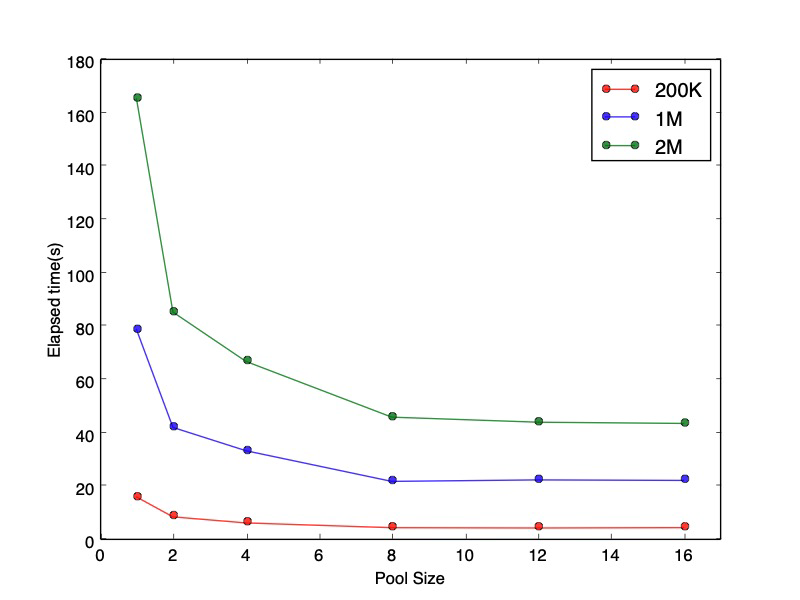
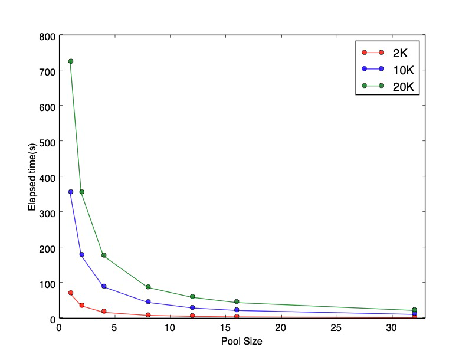
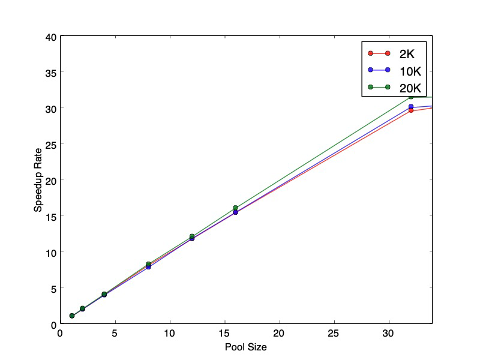

# IoTDB-CSharp客户端的定制化SessionPool机制

### 主要参数

- `_username`：用户名
- `_password`：密码
- `_zoneId`：时区
- `_host`：主机ip
- `_port`：端口号
- `_fetchSize`：单次请求数据大小
- `_poolSize`：线程池大小（默认为4）

### 数据结构

- #### Client

该数据结构对**客户端连接**进行了封装，维护一个客户端实例**TSIService.Client、**线程码**SessionId**与状态码**StatementId**以及分帧传输流**TFramedTransport。**

```c#
public Client(TSIService.Client client, long sessionId, long statementId, TFramedTransport transport)
{
    ServiceClient = client;
    SessionId = sessionId;
    StatementId = statementId;
    Transport = transport;
}
```

- #### ConcurrentClientQueue

该数据结构封装了一个**高效的线程安全队列**，用于维护客户端与服务器的多个Client连接。

### Client-Server交互全流程

- #### 建立Client连接
  - 用户创建一个**SessionPool**并调用**Open()**函数后，系统会创建一个**ConcurrentClientQueue**实例，并向其中创建并添加 _poolSize 个**Client**连接（客户端连接）。
  - 创建**Client**连接时，首先建立Tcp连接并获得**TSIService.Client**的实例，然后通过**openSessionAsync()**函数为该客户端开启一个新的线程，开启成功后获得线程码**SessionId**与状态码**StatementId**，进而创建一个**Client**连接。
  - 添加**Client**连接时，调用**ConcurrentClientQueue**的**Add()**函数，代码如下：

```c#
public void Add(Client client)
{
    Monitor.Enter(ClientQueue);
    ClientQueue.Enqueue(client);
    Monitor.Pulse(ClientQueue);
    Monitor.Exit(ClientQueue);
}
```

> 通过System.Threading.**Monitor**类实现多线程对**ConcurrentQueue**的同步访问，以确保数据的安全性。

- #### 获取空闲连接

当请求发生时，系统会在**ConcurrentClientQueue**中寻找一个空闲的**Client**连接，即调用 **ConcurrentClientQueue** 的**Take()**函数，代码如下：

```c#
public Client Take()
{
    Monitor.Enter(ClientQueue);
    if (ClientQueue.IsEmpty)
    {
        Monitor.Wait(ClientQueue);
    }
    ClientQueue.TryDequeue(out var client);
    Monitor.Exit(ClientQueue);
    return client;
}
```

如果请求时**ConcurrentClientQueue**中没有空闲**Client**连接时，系统会调用 Monitor 类中的 **Wait()** 方法让线程等待，直到队列不为空时，弹出空闲**Client**连接。

- #### 执行操作

获取到空闲Client连接后，系统便在此连接上进行数据操作，示例如下：

```c#
public async Task<int> InsertRecordAsync(string deviceId, RowRecord record)
{
    var client = _clients.Take();    // 获取空闲的Client连接
    var req = new TSInsertRecordReq(client.SessionId, deviceId, record.Measurements, record.ToBytes(),
        record.Timestamps);
    try
    {
        var status = await client.ServiceClient.insertRecordAsync(req);
        if (_debugMode)
        {
            _logger.Info("insert one record to device {0}， server message: {1}", deviceId, status.Message);
        }
        return _utilFunctions.verify_success(status, SuccessCode);
    }

    catch (TException e)
    {
        throw new TException("Record insertion failed", e);
    }

    finally
    {
        _clients.Add(client);
    }
}
```

- #### 回收Client连接

当操作结束后，系统会回收该空闲连接，通过 **ConcurrentClientQueue.Add()** 函数将该连接重新加入队列，并在在添加后会通过 **Pulse()** 方法通知其他处于等待状态的线程。考虑到操作过程中可能出现异常，所有操作都被放在try-catch块中，即使捕获到了异常也会将该Client连接放回队列中，防止连接丢失。

### 对比评测

#### 本地测试

> ##### 测试环境：
>
> - 操作系统：macOS
> - 处理器：2.3GHz 八核 Intel Core i9
> - IoTDB版本：0.12.0



#### 远端测试

> ##### 测试环境：
>
> - 本地：
>   - 操作系统：macOS
>   - 处理器：2.3GHz 八核 Intel Core i9
> - 服务器：
>   - IoTDB版本：0.12.1





